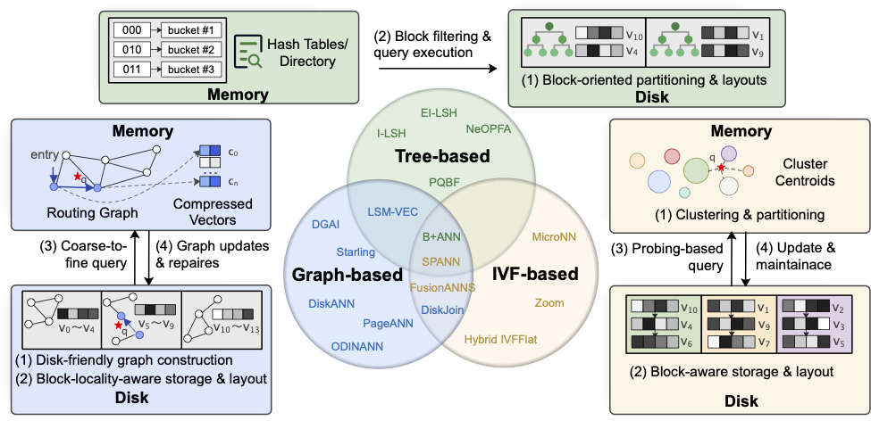
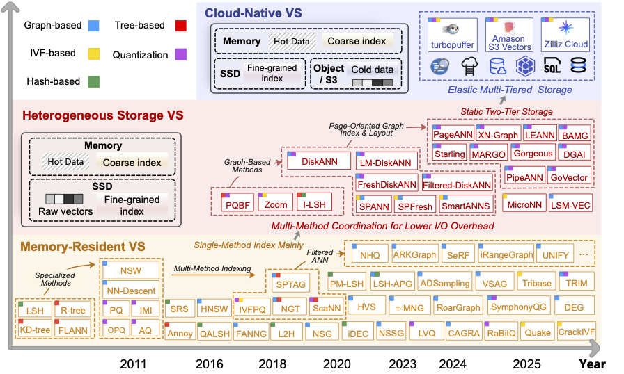

# Survey, Tutorial, and Datasets for Vector Similarity Search

* [**Disk-Resident Vector Similarity Search: A Survey**](#-disk-resident-vector-similarity-search-a-survey-paper)
* [**Vector Search for the Future: SIGMOD '26 Tutorial**](#-vector-search-for-the-future-from-memory-resident-static-heterogeneous-storage-to-cloud-native-architectures-sigmod-26-tutorial-paper)
* [**Public VSS Datasets**](#%EF%B8%8F-public-vss-datasets)

> ```
> If you find these materials useful, please cite the following papers:
> ```

```
@article{song2026vector1,
  title={Disk-Resident Vector Similarity Search: A Survey},
  author={Song, Yitong .... and Zhou, Xuanhe and .... and Xu, Jianliang},
  journal={},
  year={2026}
}

@article{song2026vector2,
  title={Vector Search for the Future: From Memory-Resident, Static Heterogeneous Storage, to Cloud-Native Architectures},
  author={Song, Yitong and Zhou, Xuanhe and Jensen, Christian S and Xu, Jianliang},
  journal={Proceedings of the ACM on Management of Data},
  year={2026}
}
```

## 💾 Disk-Resident Vector Similarity Search: A Survey [[📑paper]]()

This survey provides the first comprehensive and systematic review of **disk-resident VSS** methods, summarizing how existing approaches are redesigned to mitigate I/O bottlenecks in hybrid memory–disk architectures.
We categorize existing methods into three major classes, i.e., **IVF-based**, **graph-based**, and **tree-based** approaches, based on the fine-grained filtering structures they employ. For each category, we further decompose the overall design into key technical components, including **index construction**, **block-aware layouts**, **query execution strategies**, and **update mechanisms**. Moreover, we summarize commonly used datasets to facilitate reproducible benchmarking, and identify open challenges and promising directions for future research. 

### 


## 🚀 Vector Search for the Future: From Memory-Resident, Static Heterogeneous Storage, to Cloud-Native Architectures ***(SIGMOD '26 Tutorial)*** [[📑paper]](https://arxiv.org/pdf/2601.01937)

In this tutorial, we review the evolution of VS techniques from a storage-architecture perspective. We first review **memory-resident** methods, covering classical IVF-, hash-, quantization-, and graph-based designs. We then present a systematic overview of **heteroge-neous storage** VS techniques, including their index designs, block-level layouts, query strategies, and update mechanisms. Finally, we examine emerging **cloud-native** systems and highlight open research opportunities for future large-scale vector retrieval systems. 




## 🗃️ Public VSS Datasets

* **Public datasets commonly adopted in VSS studies** 

| Dataset | #Dim | #N | Origin | Distance Metric | Query Size | Feature |
| --- | --- | --- | --- | --- | --- | --- |
| [MovieLens-10M](https://ann-benchmarks.com/movielens10m-jaccard.hdf5) | 65,134 | 69K | Set | Jaccard | N/A | ✅ |
| [Kosarak](https://ann-benchmarks.com/kosarak-jaccard.hdf5) | 27,983 | 74K | Set | Jaccard | N/A | ❌ |
| [OpenAI-3072](https://huggingface.co/datasets/Qdrant/dbpedia-entities-openai3-text-embedding-3-large-3072-1M) | 3,072 | 1M | Text | Euclidean | N/A | ✅ |
| [WIT-ResNet50](https://www.kaggle.com/competitions/wikipedia-image-caption/data) | 2,048 | 45K | Image | Euclidean | N/A | ❌ |
| [OpenAI-1536](https://huggingface.co/datasets/Qdrant/dbpedia-entities-openai3-text-embedding-3-large-1536-1M) | 1,536 | 1M | Text | Euclidean | N/A | ✅ |
| [Enron](https://drive.google.com/file/d/1TqV43kzuNYgAYXvXTKsAG1-ZKtcaYsmr/view) | 1,369 | 94K | Text | Angular | 200 | ✅ |
| [Wiki](https://huggingface.co/datasets/Cohere/wikipedia-2023-11-embed-multilingual-v3) | 1,024 | 247.2M | Text | Angular | N/A | ✅ |
| [MSMACRO](https://huggingface.co/datasets/Cohere/msmarco-v2.1-embed-english-v3) | 1,024 | 53.2M | Text | Angular | 1,677 | ✅ |
| [GIST](http://corpus-texmex.irisa.fr/) | 960 | 1M | Image | Euclidean | 1,000 | ❌ |
| [MNIST](https://ann-benchmarks.com/mnist-784-euclidean.hdf5) | 784 | 60K | Image | Euclidean | 10,000 | ✅ |
| [LAION-5B](https://clickhouse.com/docs/getting-started/example-datasets/laion-5b-dataset) | 768 | 5B | Image | Angular | N/A | ✅ |
| [COCO-I2I](https://github.com/fabiocarrara/str-encoders/releases/download/v0.1.3/coco-i2i-512-angular.hdf5) | 512 | 113K | Image | Angular | 10,000 | ❌ |
| [MSong](https://www.ifs.tuwien.ac.at/mir/msd/download.html) | 420 | 1M | Audio | Euclidean | 200 | ❌ |
| [Tiny](https://www.cse.cuhk.edu.hk/systems/hash/gqr/dataset/tiny5m.tar.gz) | 384 | 5M | Image | Euclidean | 10,000 | ❌ |
| [GloVe-300](https://nlp.stanford.edu/projects/glove/) | 300 | 2.2M | Text | Angular | 10,000 | ❌ |
| [Crawl](https://dl.fbaipublicfiles.com/fasttext/vectors-english/crawl-300d-2M.vec.zip) | 300 | 2M | Text | Angular | 10,000 | ❌ |
| [Facebook SimSearchNet++](https://dl.fbaipublicfiles.com/billion-scale-ann-benchmarks/FB_ssnpp_database.u8bin) | 256 | 1B | Image | Euclidean | 100,000 | ❌ |
| [UQvideo](https://drive.google.com/file/d/1HIdQSKGh7cfC7TnRvrA2dnkHBNkVHGsF/view?usp=sharing) | 256 | 1M | Video | Euclidean | 10,000 | ❌ |
| [NYTimes](https://ann-benchmarks.com/nytimes-256-angular.hdf5) | 256 | 290K | Text | Angular | 10,000 | ❌ |
| [Yandex Text-to-Image](https://research.yandex.com/blog/benchmarks-for-billion-scale-similarity-search) | 200 | 1B | Text & Image | Inner-product | 100,000 | ❌ |
| [GloVe-200](https://nlp.stanford.edu/projects/glove/) | 200 | 1.2M | Text | Angular | 10,000 | ❌ |
| [Audio](https://www.cse.cuhk.edu.hk/systems/hash/gqr/dataset/audio.tar.gz) | 192 | 53K | Audio | Euclidean | 200 | ❌ |
| [SIFT](http://corpus-texmex.irisa.fr/) | 128 | 1B | Image | Euclidean | 10,000 | ❌ |
| [SPACEV](https://github.com/microsoft/SPTAG/tree/main/datasets/SPACEV1B) | 100 | 1.4B | Text | Euclidean | 29,316 | ❌ |
| [Turing](https://comp21storage.z5.web.core.windows.net/comp21/MSFT-TURING-ANNS/base1b.fbin) | 100 | 1B | Text | Euclidean | 100,000 | ❌ |
| [GloVe-100](https://nlp.stanford.edu/projects/glove/) | 100 | 1.2M | Text | Angular | 10,000 | ❌ |
| [DEEP](https://research.yandex.com/blog/benchmarks-for-billion-scale-similarity-search) | 96 | 1B | Image | Euclidean | 10,000 | ❌ |

### Dataset Descriptions

- **[MovieLens-10M](https://dl.acm.org/doi/pdf/10.1145/2827872)** is a movie recommender dataset containing 10M user–movie ratings plus tag applications (with movie/user IDs and tags as metadata), which is commonly converted into high-dimensional sparse sets/vectors (e.g., item/tag incidence) for set-similarity search (e.g., Jaccard).
- **[Kosarak](https://dl.acm.org/doi/pdf/10.1145/1007730.1007744)** is an anonymized click-stream transaction log from a Hungarian online news portal, where each record is a sparse set of item/page IDs and can be directly used as a set/binary vector.
- **[OpenAI-3072](https://huggingface.co/datasets/Qdrant/dbpedia-entities-openai3-text-embedding-3-large-3072-1M), [OpenAI-1536](https://huggingface.co/datasets/Qdrant/dbpedia-entities-openai3-text-embedding-3-large-1536-1M)** are text embedding datasets derived from the first one million entries of *[dbpedia-entity](https://openreview.net/forum?id=wCu6T5xFjeJ)*. Each entry concatenates the *title* and *text* fields and is encoded using the OpenAI *[text-embedding-3-large](https://platform.openai.com/docs/models/text-embedding-3-large)* model. The dataset is released in two dimensionalities (3072 and 1536) and includes metadata such as *id*, *title*, and *text*.
- **[WIT-ResNet50](https://dl.acm.org/doi/pdf/10.1145/3404835.3463257)** is an auxiliary vector dataset released for the Wikipedia Image–Caption Matching competition, consisting of a large subset of WIT images represented by 2048-dimensional [*ResNet-50*](https://openaccess.thecvf.com/content_cvpr_2016/papers/He_Deep_Residual_Learning_CVPR_2016_paper.pdf) features extracted from the penultimate layer of an ImageNet-pretrained model.
- **[Enron](https://bklimt.com/papers/2004_klimt_ecml.pdf)** is a large email corpus (message text plus headers such as sender/recipient and folder organization), commonly vectorized via text representations, and it includes folder structure/metadata that can be used as filter attributes.
- **[Wiki](https://dumps.wikimedia.org)** is a multilingual Wikipedia paragraph corpus (300+ languages) where articles are chunked into paragraphs and encoded into 1024-dimensional vectors using *[Cohere Embed v3](https://cohere.com/blog/introducing-embed-v3)* model; each record retains metadata fields such as *url*, *title*, and *text* that can be used for filtering.
- **[MSMARCO](https://openreview.net/pdf?id=Hk1iOLcle)** is a large-scale web search corpus (Bing-derived queries and retrieved web documents) that is released as a segmented document collection with document metadata (e.g., URL, title, headings), where each segment and query is encoded into a 1024-dimensional dense vector using *[Cohere Embed English v3](https://cohere.com/blog/introducing-embed-v3)* model for semantic retrieval, enabling metadata-based filtering.
- **[GIST](https://ieeexplore.ieee.org/document/5432202/)** is an image dataset where each item is represented by a 960-dimensional vector.
- **[MNIST](https://huggingface.co/datasets/ylecun/mnist)** contains handwritten digit images that are typically flattened into 784-dimensional vectors.
- **[LAION-5B](https://proceedings.neurips.cc/paper_files/paper/2022/file/a1859debfb3b59d094f3504d5ebb6c25-Paper-Datasets_and_Benchmarks.pdf)** is a large-scale image–text corpus with associated metadata, where embeddings are explicitly generated using *[CLIP](https://proceedings.mlr.press/v139/radford21a/radford21a.pdf)*  *[ViT-L/14](https://arxiv.org/pdf/2010.11929/100)* into 768-dimensional vectors for searching.
- **[COCO-I2I](https://arxiv.org/pdf/1405.0312)** is an image collection with rich annotations (captions and object labels), typically converted into 512-dimensional image embeddings by an image encoder for image-to-image retrieval.
- **[MSong](https://academiccommons.columbia.edu/doi/10.7916/D8377K1H/download)** is a music dataset providing audio features and track metadata, where each track is represented as a 420-dimensional audio feature vector.
- **[Tiny](https://ieeexplore.ieee.org/document/4531741/)** is a web-crawled collection of 32×32 color images, and the widely used Tiny5M benchmark samples 5 million images and represents each image as a 384-dimensional vector for similarity search.
- **[GloVe](https://aclanthology.org/D14-1162/)** provides pretrained word embeddings learned from large text corpora (e.g., Wikipedia + Gigaword, Common Crawl, and Twitter), released as dense vectors with multiple dimensionalities, typically 50, 100, 200, or 300 dimensions depending on the corpus.
- **[Crawl](https://aclanthology.org/L18-1008.pdf)** is a text-derived vector dataset consisting of pretrained word embeddings learned from the Common Crawl corpus, with widely used releases typically having 300 dimensions.
- **[Facebook SimSearchNet++](https://proceedings.mlr.press/v176/simhadri22a/simhadri22a.pdf)** is an image descriptor dataset released by Facebook, widely used for applications such as copyright enforcement and content moderation. The original vectors are PCA-compressed to 256 dimensions.
- **[UQvideo](https://dl.acm.org/doi/pdf/10.1145/2072298.2072354)** is a near-duplicate video dataset in which videos are represented using multiple visual feature embeddings for retrieval, with the specific vector representations depending on the chosen feature extraction pipeline.
- **[NYTimes](https://doi.org/10.24432/C5ZG6P)** is a news-article corpus represented as bag-of-words count vectors (document–term frequencies), which are commonly used either directly as sparse integer vectors or further transformed into dense embeddings.
- **[Yandex Text-to-Image](https://proceedings.mlr.press/v176/simhadri22a/simhadri22a.pdf)** is a billion-scale cross-modal retrieval dataset in which the database contains 1B image embeddings produced by the *[SE-ResNeXt-101](https://openaccess.thecvf.com/content_cvpr_2018/papers/Hu_Squeeze-and-Excitation_Networks_CVPR_2018_paper.pdf)* model, while queries are text embeddings produced by a variant of the *[DSSM](https://dl.acm.org/doi/pdf/10.1145/2505515.2505665)* model; both modalities are mapped into a shared 200-dimensional space learned from clickthrough data via a triplet-loss variant.
- **[Audio](https://dl.acm.org/doi/pdf/10.1145/1963405.1963487)** is a public audio-feature dataset represented as 192-dimensional dense vectors and is widely used in ANN benchmarking suites.
- **[SIFT](https://ieeexplore.ieee.org/document/5946540)** is an image descriptor dataset in which each item corresponds to a 128-dimensional local feature vector, commonly adopted in standard billion-scale similarity search benchmarks.
- **[SPACEV](https://proceedings.mlr.press/v176/simhadri22a/simhadri22a.pdf)** is a web-search dataset where documents and queries are encoded as dense vectors using the *[Microsoft SpaceV Superior](https://ieeexplore.ieee.org/document/9671546/)* model.
- **[Turing](https://proceedings.mlr.press/v176/simhadri22a/simhadri22a.pdf)** is a web query similarity dataset consisting of 1B query embeddings, where web search queries are encoded by the universal-language AGI/SpaceV5 model built on the *[Turing-NLG](https://www.microsoft.com/en-us/research/blog/turing-nlg-a-17-billion-parameter-language-model-by-microsoft/)* architecture to capture generic intent representations.
- **[DEEP](https://openaccess.thecvf.com/content_cvpr_2016/papers/Babenko_Efficient_Indexing_of_CVPR_2016_paper.pdf)** is a billion-scale image embedding dataset in which vectors are extracted from *[GoogLeNet](https://www.cv-foundation.org/openaccess/content_cvpr_2015/papers/Szegedy_Going_Deeper_With_2015_CVPR_paper.pdf)* features and subsequently PCA-compressed (e.g., to 96 dimensions) and L2-normalized.

